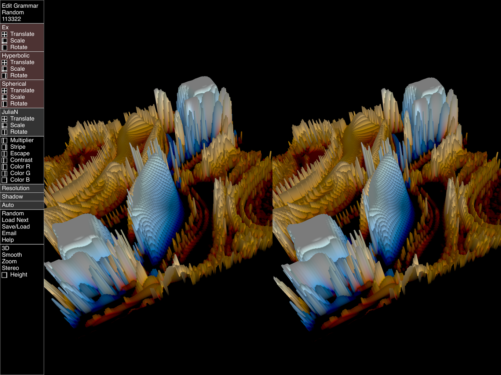
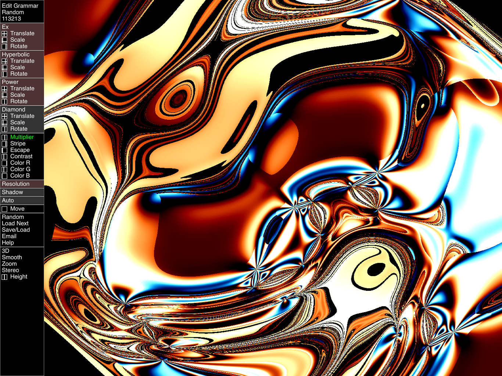
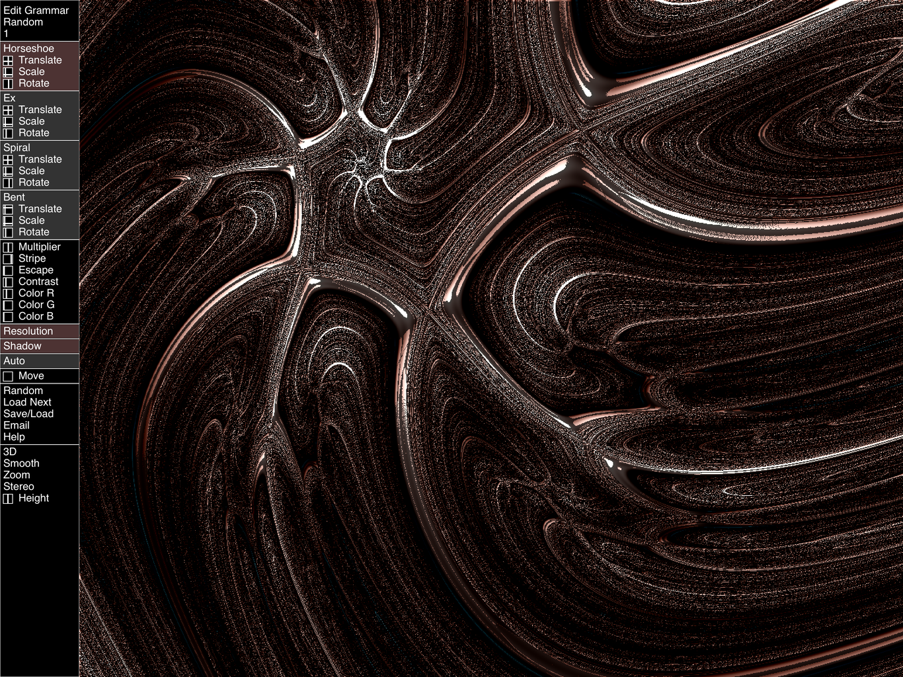

# MishMash2

Update Jan 13, 2020:   XCode 11.3.1,  Swift 5
Fixed crash because of pixel format mis-match

iPad app creates 2D and 3D modern art using Swift and Metal.

The original MishMash app produces beautiful modern art.\
This is the same engine with a whole new UX design.

It is very easy and efficient to develop with, \
and makes good use of little space on the screen. \
Hope you like it!

